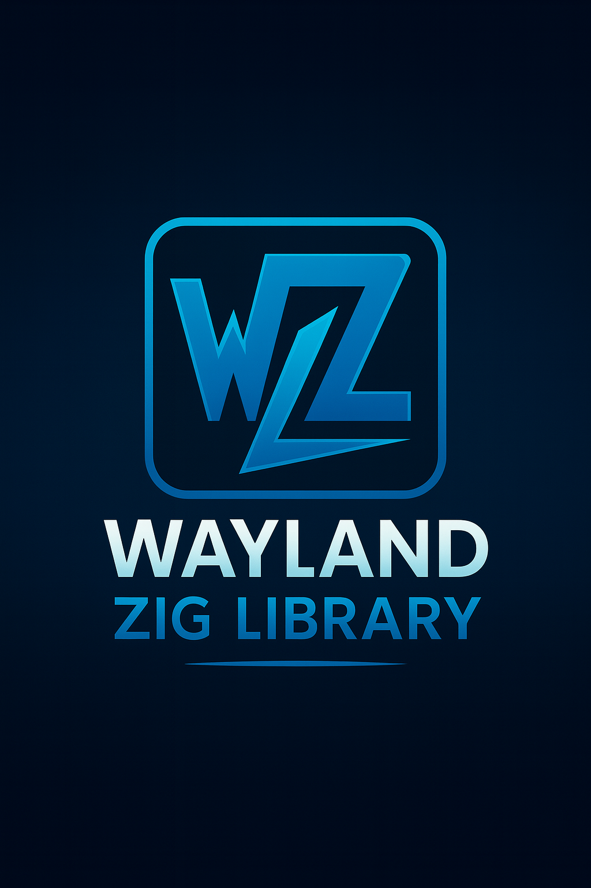

# wzl

<div align="center">
  

**Wayland Zig Library – Modern Protocol Implementation**


</div>

---

## Overview

**wzl** (Wayland Zig Library) is a **Zig-native implementation** of the Wayland protocol designed for modern display servers, compositors, and GUI applications. Built with Zig's memory safety, async capabilities, and performance in mind, wzl provides a clean, type-safe API for Wayland development.

Whether you're building a custom compositor, a remote desktop solution, or integrating Wayland support into your Zig application (like a terminal emulator), wzl offers a robust foundation with async event loops, secure streaming, and hardware-accelerated rendering.

---

## Features

- 🔹 **Complete Wayland Protocol Support**: Full core protocol bindings with stable implementation
- 🔹 **Client & Compositor APIs**: High-level APIs for both client applications and display servers
- 🔹 **Async Architecture**: Event-driven design powered by [`zsync`](https://github.com/ghostkellz/zsync) for non-blocking I/O
- 🔹 **Memory Safety**: Strong typing and safe buffer management leveraging Zig's guarantees
- 🔹 **Rich Extensions**: XDG shell, input devices, output management, decorations, and more
- 🔹 **Rendering Backends**: Support for EGL, Vulkan, and software rendering with GPU acceleration
- 🔹 **Remote Desktop**: High-performance streaming over QUIC using [`zquic`](https://github.com/ghostkellz/zquic)
- 🔹 **Security**: Optional [`zcrypto`](https://github.com/ghostkellz/zcrypto) integration for encrypted sessions
- 🔹 **Cross-Platform**: Optimized for Linux with hardware-specific tuning
- 🔹 **Terminal Integration**: Ready for use in Zig-based terminal emulators like Ghostty forks

---

## Installation

### Prerequisites
- Zig 0.16.0 or later
- Linux system with Wayland support

### Building from Source

```bash
git clone https://github.com/ghostkellz/wzl.git
cd wzl
zig build
```

The compiled library will be available in `zig-out/lib/`.

### Dependencies
wzl integrates with several Zig libraries:
- [`zsync`](https://github.com/ghostkellz/zsync) - Async runtime
- [`zcrypto`](https://github.com/ghostkellz/zcrypto) - Cryptography (optional)
- [`zquic`](https://github.com/ghostkellz/zquic) - QUIC protocol (for remote desktop)

---

## Quick Start

### Basic Client Example

```zig
const std = @import("std");
const wzl = @import("wzl");

pub fn main() !void {
    var gpa = std.heap.GeneralPurposeAllocator(.{}){};
    defer std.debug.assert(!gpa.deinit());
    const allocator = gpa.allocator();

    // Initialize async runtime
    var runtime = try zsync.Runtime.init(allocator);
    defer runtime.deinit();

    // Create Wayland client
    var client = try wzl.Client.init(allocator, runtime, .{});
    defer client.deinit();

    // Connect and run event loop
    try client.connect();
    try client.run();
}
```

### Simple Compositor

```zig
const std = @import("std");
const wzl = @import("wzl");

pub fn main() !void {
    var gpa = std.heap.GeneralPurposeAllocator(.{}){};
    defer std.debug.assert(!gpa.deinit());
    const allocator = gpa.allocator();

    var runtime = try zsync.Runtime.init(allocator);
    defer runtime.deinit();

    // Create compositor framework
    var compositor = try wzl.CompositorFramework.init(allocator, runtime);
    defer compositor.deinit();

    // Run the compositor
    try compositor.run();
}
```

---

## Documentation

Comprehensive documentation is available in the [`docs/`](docs/) directory:

- [Getting Started](docs/getting-started.md) - Setup and basic usage
- [Architecture](docs/architecture.md) - System design and components
- [API Reference](docs/api/) - Detailed API documentation
- [Examples](docs/examples/) - Code samples and tutorials
- [Performance](docs/performance.md) - Optimization guides
- [Remote Desktop](docs/remote-desktop.md) - QUIC streaming setup
- [Terminal Integration](docs/integrations/terminal-emulators.md) - Using wzl in terminal emulators
- [Build System](docs/build-system.md) - Build configuration and dependencies
- [Contributing](docs/contributing.md) - Development guidelines

---

## Roadmap

- [x] Core Wayland protocol (stable)
- [x] XDG shell support (windows, popups, layers)
- [x] Input devices (keyboard, mouse, touch, tablet)
- [x] Rendering backends (EGL, Vulkan, software)
- [x] Remote desktop + streaming over QUIC ([`zquic`](https://github.com/ghostkellz/zquic))
- [x] High-level compositor framework for custom shells
- [x] Comprehensive documentation and examples
- [x] Performance optimizations and hardware acceleration
- [x] Cross-platform support and testing

---

## Contributing

We welcome contributions! Please see our [Contributing Guide](docs/contributing.md) for details on:

- Development setup
- Code style and conventions
- Testing guidelines
- Pull request process

---

## License

Licensed under the MIT License. See [LICENSE](LICENSE) for details.

---

<div align="center">
  <p>Built with ❤️ using Zig</p>
</div>

