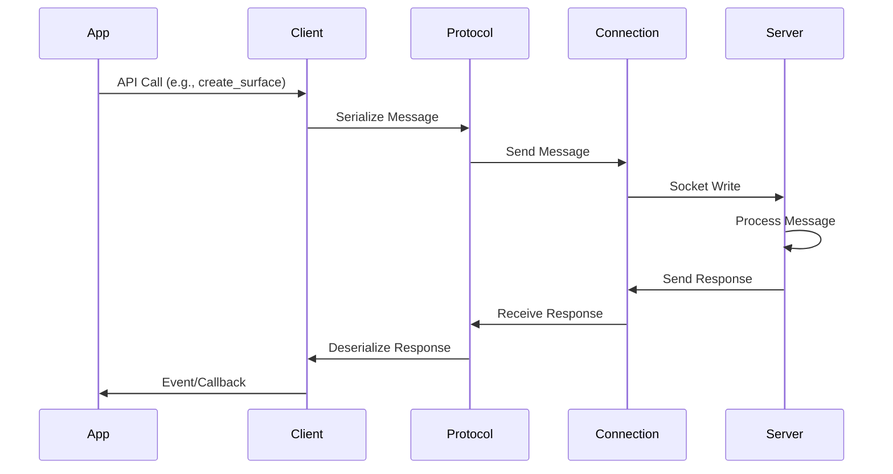
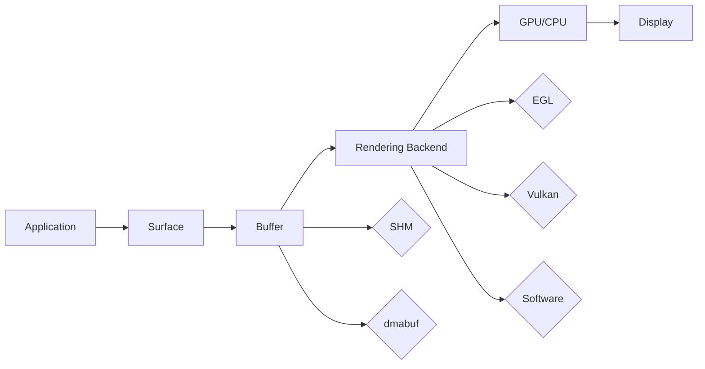

# wzl Architecture

This document describes the internal architecture of the wzl (Wayland Zig Library), providing insight into its design principles and implementation details.

## 🏗️ Core Architecture

wzl is built around several key architectural principles:

### Memory Safety First
- **Zig's Safety Guarantees**: Compile-time bounds checking and null safety
- **RAII Pattern**: Resource management through structured lifetimes
- **No Garbage Collection**: Deterministic memory management with explicit ownership

### Async by Design
- **zsync Integration**: Cooperative multitasking for I/O operations
- **Non-blocking I/O**: All network and file operations are async
- **Event-driven**: Reactive programming model for UI and system events

### Modular Components
- **Separation of Concerns**: Clear boundaries between protocol, client, and server
- **Composable APIs**: Mix and match components for different use cases
- **Extension System**: Pluggable architecture for Wayland extensions

## 📦 Core Components

### 1. Protocol Layer (`protocol.zig`)

The foundation of wzl's Wayland implementation:

```zig
pub const Message = struct {
    header: MessageHeader,
    arguments: []const Argument,
    allocator: std.mem.Allocator,
};
```

**Responsibilities:**
- Message serialization/deserialization
- Object ID management
- Interface definitions
- Fixed-point arithmetic
- File descriptor handling

**Key Features:**
- Zero-copy serialization where possible
- SIMD-optimized for common message types
- Memory-safe argument parsing
- Comprehensive error handling

### 2. Connection Layer (`connection.zig`)

Handles the low-level socket communication:

```zig
pub const Connection = struct {
    socket: net.Stream,
    allocator: std.mem.Allocator,
    runtime: ?*zsync.Runtime,
    // ... buffers and queues
};
```

**Responsibilities:**
- Socket establishment and management
- Message framing and transmission
- File descriptor passing
- Connection lifecycle management

**Key Features:**
- Async I/O with zsync integration
- Automatic reconnection logic
- Buffer pooling for performance
- Platform-specific optimizations

### 3. Client Layer (`client.zig`)

High-level client API for Wayland applications:

```zig
pub const Client = struct {
    connection: connection.Connection,
    allocator: std.mem.Allocator,
    objects: std.HashMap(ObjectId, ObjectType),
    runtime: ?*zsync.Runtime,
};
```

**Responsibilities:**
- Object lifecycle management
- Event dispatching
- Registry interaction
- Surface and buffer management

**Key Features:**
- Type-safe object management
- Automatic event routing
- Registry-based extension discovery
- Memory-safe resource cleanup

### 4. Server Layer (`server.zig`)

Compositor framework for Wayland servers:

```zig
pub const Server = struct {
    socket_path: []const u8,
    clients: std.ArrayList(*Client),
    globals: std.HashMap([]const u8, *Global),
    runtime: ?*zsync.Runtime,
};
```

**Responsibilities:**
- Client connection management
- Global object advertisement
- Resource allocation and cleanup
- Event broadcasting

**Key Features:**
- Multi-client support
- Dynamic global management
- Resource quota management
- Security boundary enforcement

## 🔄 Data Flow

### Client to Server Communication



### Rendering Pipeline



## 🧵 Threading Model

wzl uses a cooperative multitasking model:

### Single-Threaded Event Loop
- All operations run on a single thread
- zsync provides cooperative scheduling
- No shared mutable state between coroutines

### Async I/O Operations
```zig
// Example async operation
pub async fn sendMessage(self: *Connection, message: protocol.Message) !void {
    const bytes = try message.serialize(&self.send_buffer);
    _ = try await self.socket.writeAll(self.send_buffer[0..bytes]);
}
```

### Event Dispatching
- Events are queued and processed in order
- Callbacks are invoked synchronously
- No reentrancy issues

## 🔒 Security Architecture

### Memory Safety
- **Bounds Checking**: All array accesses are bounds-checked
- **Null Safety**: Optional types prevent null pointer dereferences
- **Resource Management**: RAII ensures proper cleanup

### Protocol Security
- **Object Validation**: All object IDs are validated
- **Permission Checking**: Access control for sensitive operations
- **Input Validation**: All protocol messages are validated

### Network Security
- **QUIC Encryption**: End-to-end encryption for remote sessions
- **Certificate Validation**: Proper TLS certificate handling
- **Replay Protection**: QUIC's built-in replay protection

## 📊 Performance Characteristics

### Memory Usage
- **Arena Allocators**: Request-scoped memory management
- **Object Pooling**: Reuse of common objects
- **Buffer Pooling**: Network buffer reuse

### CPU Usage
- **SIMD Operations**: Vectorized message processing
- **Async I/O**: Non-blocking operations reduce context switches
- **Cache-Friendly**: Data structures optimized for cache performance

### Network Efficiency
- **Message Batching**: Multiple messages sent in single syscall
- **Zero-Copy**: Direct buffer access where possible
- **Compression**: Optional compression for remote sessions

## 🔧 Extension System

wzl supports Wayland extensions through a modular architecture:

### Core Extensions
- **XDG Shell**: Modern window management
- **Input Devices**: Keyboard, mouse, touch support
- **Output Management**: Multi-monitor support
- **Buffer Management**: SHM and dmabuf support

### Custom Extensions
- **Plugin Architecture**: Load extensions at runtime
- **Type Safety**: Compile-time extension validation
- **Version Negotiation**: Automatic version compatibility

## 🐧 Platform Integration

### Linux Optimizations
- **Arch Linux Specific**: Hardware-specific optimizations
- **Kernel Features**: io_uring, GSO, GRO support
- **Filesystem**: Efficient file descriptor handling

### Cross-Platform Compatibility
- **POSIX Compliance**: Standard system interfaces
- **Feature Detection**: Runtime capability detection
- **Fallback Mechanisms**: Graceful degradation

## 🔄 Evolution and Maintenance

### Versioning Strategy
- **Semantic Versioning**: Major.minor.patch format
- **API Stability**: Backward compatibility guarantees
- **Deprecation Warnings**: Gradual migration support

### Testing Strategy
- **Unit Tests**: Individual component testing
- **Integration Tests**: End-to-end functionality
- **Performance Tests**: Benchmarking and profiling
- **Fuzz Testing**: Protocol message validation

This architecture provides a solid foundation for building high-performance, secure, and maintainable Wayland applications in Zig.</content>
<parameter name="filePath">/data/projects/wzl/docs/architecture.md