```mermaid
graph TB
    A[wzl Library] --> B[Core Protocol]
    A --> C[Client API]
    A --> D[Server API]
    A --> E[Extensions]

    B --> F[Message Serialization]
    B --> G[Object Management]
    B --> H[Event Loop]

    C --> I[Surface Creation]
    C --> J[Buffer Management]
    C --> K[Input Handling]

    D --> L[Compositor Framework]
    D --> M[Output Management]
    D --> N[Client Management]

    E --> O[XDG Shell]
    E --> P[Decorations]
    E --> Q[Clipboard]
    E --> R[Terminal Integration]

    A --> S[Async Runtime]
    S --> T[zsync Integration]

    A --> U[Network Layer]
    U --> V[QUIC Streaming]
    U --> W[Remote Desktop]

    A --> X[Security Layer]
    X --> Y[zcrypto Integration]
```

# wzl Documentation

Welcome to the official documentation for **wzl** (Wayland Zig Library) - a modern, high-performance implementation of the Wayland protocol in Zig.

## 📚 Documentation Overview

This documentation covers everything you need to know about using wzl for Wayland development:

### 🚀 Quick Start
- [Getting Started](getting-started.md) - Installation and basic setup
- [Listener API Migration](LISTENER_API_MIGRATION.md) - Backward-compatible callback API
- [Hello World](examples/hello-world.md) - Your first wzl application
- [Build System](build-configuration.md) - Building and integrating wzl

### 📖 Core Concepts
- [Architecture](architecture.md) - Understanding wzl's design
- [Wayland Protocol](wayland-protocol.md) - Protocol implementation details
- [Async Programming](async-programming.md) - Working with zsync
- [Memory Management](memory-management.md) - Safe buffer and resource handling

### 🛠️ API Reference
- [Client API](api/client.md) - Creating Wayland clients
- [Server API](api/server.md) - Building compositors
- [Rendering](api/rendering.md) - Display and GPU integration
- [Input Handling](api/input.md) - Keyboard, mouse, and touch
- [Buffer Management](api/buffer.md) - Shared memory and dmabuf
- [Extensions](api/extensions.md) - XDG shell, decorations, etc.

### 🌐 Advanced Features
- [Remote Desktop](remote-desktop.md) - QUIC-based remote sessions
- [QUIC Streaming](quic-streaming.md) - High-performance data streaming
- [Security](security.md) - Encryption and authentication
- [Performance](performance.md) - Optimization and benchmarking

### 🔧 Integration Guides
- [Terminal Emulators](integrations/terminal-emulators.md) - Ghostty integration
- [Window Managers](integrations/window-managers.md) - Custom compositor development
- [Gaming](integrations/gaming.md) - Game development with Wayland
- [Embedded](integrations/embedded.md) - Embedded and IoT applications

### 📋 Examples
- [Simple Compositor](examples/simple-compositor.md)
- [Terminal Client](examples/terminal-client.md)
- [Remote Desktop](examples/remote-desktop.md)
- [Game Integration](examples/game-integration.md)

## 🎯 Key Features

wzl provides a complete Wayland protocol implementation with:

- **🔒 Memory Safety**: Zig's compile-time safety guarantees
- **⚡ High Performance**: Optimized for modern hardware
- **🔄 Async Ready**: Built on zsync for non-blocking I/O
- **🌐 Network Enabled**: QUIC streaming for remote sessions
- **🎮 GPU Accelerated**: Multiple rendering backends
- **📱 Cross Platform**: Linux-focused with broad compatibility
- **🛡️ Secure**: Encrypted remote sessions with zcrypto
- **🔧 Developer Friendly**: Clean APIs and comprehensive docs

## 📊 Architecture



## 🚀 Getting Started

### Installation

```bash
# Clone the repository
git clone https://github.com/ghostkellz/wzl.git
cd wzl

# Build the library
zig build

# Run tests
zig build test

# Build examples
zig build examples
```

### Your First Application

```zig
const std = @import("std");
const wzl = @import("wzl");

pub fn main() !void {
    var gpa = std.heap.GeneralPurposeAllocator(.{}){};
    defer std.debug.assert(gpa.deinit() == .ok);
    const allocator = gpa.allocator();

    // Create a Wayland client
    var client = try wzl.Client.init(allocator, .{});
    defer client.deinit();

    // Connect to the display
    try client.connect();

    // Get the registry
    const registry = try client.getRegistry();

    // Your application logic here...
    std.debug.print("Connected to Wayland display!\n", .{});
}
```

## 📈 Performance

wzl is designed for high performance:

- **Zero-copy operations** where possible
- **SIMD-accelerated** message processing
- **Async I/O** for non-blocking operations
- **GPU acceleration** with multiple backends
- **Memory pooling** for reduced allocations
- **Arch Linux optimizations** for modern hardware

## 🤝 Contributing

We welcome contributions! See our [Contributing Guide](contributing.md) for details.

## 📄 License

wzl is licensed under the MIT License. See [LICENSE](../LICENSE) for details.

## 📞 Support

- **Issues**: [GitHub Issues](https://github.com/ghostkellz/wzl/issues)
- **Discussions**: [GitHub Discussions](https://github.com/ghostkellz/wzl/discussions)
- **Documentation**: This documentation site

---

**Built with ❤️ using Zig and modern systems programming principles.**</content>
<parameter name="filePath">/data/projects/wzl/docs/README.md