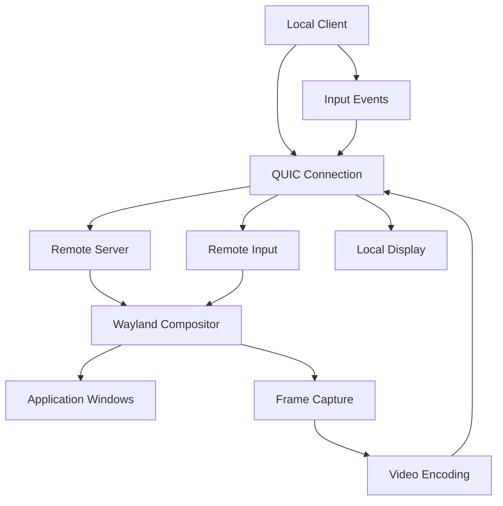

# wzl Remote Desktop

wzl provides comprehensive remote desktop functionality through QUIC-based streaming, enabling secure, high-performance remote Wayland sessions.

## 🌐 Remote Desktop Architecture

The remote desktop system consists of several key components:



## 🚀 Quick Start

### Setting Up Remote Desktop Server

```zig
const std = @import("std");
const wzl = @import("wzl");

pub fn main() !void {
    var gpa = std.heap.GeneralPurposeAllocator(.{}){};
    defer std.debug.assert(gpa.deinit() == .ok);
    const allocator = gpa.allocator();

    // Configure remote desktop server
    const config = wzl.RemoteDesktopConfig{
        .listen_address = "0.0.0.0",
        .listen_port = 5900, // VNC-like port
        .enable_encryption = true,
        .enable_compression = true,
        .max_clients = 5,
        .frame_rate = 60,
        .quality = .high,
    };

    // Create remote desktop server
    var server = try wzl.RemoteDesktopServer.init(allocator, config);
    defer server.deinit();

    // Start the server
    try server.start();

    std.debug.print("Remote desktop server running on port 5900\n", .{});

    // Run event loop
    try server.run();
}
```

### Connecting as Remote Client

```zig
// Create remote desktop client
const client_config = wzl.RemoteDesktopClientConfig{
    .server_address = "192.168.1.100",
    .server_port = 5900,
    .enable_encryption = true,
    .preferred_quality = .high,
};

var client = try wzl.RemoteDesktopClient.init(allocator, client_config);
defer client.deinit();

// Connect to remote server
try client.connect();

// Start receiving remote desktop
try client.startStreaming();

// Handle remote input
client.setInputHandler(struct {
    pub fn handleKey(self: *anyopaque, keycode: u32, pressed: bool) void {
        _ = self;
        // Send key event to remote server
        try client.sendKeyEvent(keycode, pressed);
    }

    pub fn handlePointer(self: *anyopaque, x: f64, y: f64, button: u32, pressed: bool) void {
        _ = self;
        // Send pointer event to remote server
        try client.sendPointerEvent(x, y, button, pressed);
    }
}.handleKey, .handlePointer);
```

## ⚙️ Configuration Options

### Server Configuration

```zig
const server_config = wzl.RemoteDesktopConfig{
    // Network settings
    .listen_address = "0.0.0.0",
    .listen_port = 5900,

    // Security
    .enable_encryption = true,
    .certificate_path = "/path/to/cert.pem",
    .private_key_path = "/path/to/key.pem",

    // Performance
    .enable_compression = true,
    .compression_level = 6, // 1-9, 6 is balanced
    .frame_rate = 60,
    .quality = .high,

    // Resource limits
    .max_clients = 10,
    .max_bandwidth = 100 * 1024 * 1024, // 100 Mbps
    .buffer_size = 8 * 1024 * 1024, // 8MB

    // Display settings
    .capture_cursor = true,
    .capture_damage = true,
    .multi_monitor = true,
};
```

### Client Configuration

```zig
const client_config = wzl.RemoteDesktopClientConfig{
    // Connection
    .server_address = "remote-server.com",
    .server_port = 5900,

    // Authentication
    .username = "user",
    .password = "password",
    .certificate_path = "/path/to/ca-cert.pem",

    // Quality settings
    .preferred_quality = .ultra,
    .adaptive_quality = true,
    .min_frame_rate = 30,
    .max_bandwidth = 50 * 1024 * 1024, // 50 Mbps

    // Input settings
    .enable_local_cursor = true,
    .relative_mouse = false,
    .grab_keyboard = false,
};
```

## 🔐 Security Features

### End-to-End Encryption

```zig
// Server-side encryption setup
const crypto_config = wzl.CryptoConfig{
    .cipher = .aes256_gcm,
    .key_exchange = .x25519,
    .certificate_verification = .strict,
};

try server.enableEncryption(crypto_config);
```

### Certificate Management

```zig
// Load server certificate
const cert_data = try std.fs.readFileAlloc(allocator, "server.crt");
defer allocator.free(cert_data);

const key_data = try std.fs.readFileAlloc(allocator, "server.key");
defer allocator.free(key_data);

try server.loadCertificate(cert_data, key_data);
```

### Access Control

```zig
// Configure access control
const acl = wzl.AccessControlList{
    .allow_list = &[_][]const u8{
        "192.168.1.0/24",  // Local network
        "10.0.0.0/8",      // VPN network
    },
    .deny_list = &[_][]const u8{
        "192.168.1.100",   // Blocked IP
    },
    .require_authentication = true,
};

try server.setAccessControl(acl);
```

## 📊 Performance Optimization

### Quality Settings

```zig
pub const Quality = enum {
    low,      // 480p, 30fps, high compression
    medium,   // 720p, 30fps, medium compression
    high,     // 1080p, 60fps, low compression
    ultra,    // 4K, 60fps, lossless
};
```

### Bandwidth Management

```zig
// Adaptive quality based on bandwidth
const adaptive_config = wzl.AdaptiveConfig{
    .enable_adaptive_quality = true,
    .bandwidth_threshold_low = 5 * 1024 * 1024,   // 5 Mbps
    .bandwidth_threshold_high = 25 * 1024 * 1024, // 25 Mbps
    .quality_low = .low,
    .quality_medium = .medium,
    .quality_high = .high,
};

try client.enableAdaptiveStreaming(adaptive_config);
```

### Frame Rate Control

```zig
// Dynamic frame rate adjustment
client.setFrameRateCallback(struct {
    pub fn onFrameRateChange(self: *anyopaque, new_fps: u32) void {
        _ = self;
        std.debug.print("Frame rate adjusted to: {} FPS\n", .{new_fps});

        // Adjust application rendering accordingly
        adjustRenderingForFrameRate(new_fps);
    }
}.onFrameRateChange);
```

## 🎥 Video Encoding

### Supported Codecs

```zig
pub const VideoCodec = enum {
    h264,     // Hardware accelerated, widely supported
    h265,     // Better compression, newer hardware
    vp8,      // WebRTC compatible
    vp9,      // Better quality than VP8
    av1,      // Latest generation, best quality
};
```

### Hardware Acceleration

```zig
// Enable hardware-accelerated encoding
const hw_config = wzl.HardwareAccelConfig{
    .enable_hw_encoding = true,
    .preferred_codec = .h264,
    .device = "/dev/dri/renderD128", // Intel GPU
    .max_bitrate = 50 * 1024 * 1024, // 50 Mbps
};

try server.enableHardwareAcceleration(hw_config);
```

### Region of Interest (ROI)

```zig
// Encode cursor area with higher quality
const roi_config = wzl.ROIConfig{
    .cursor_region = .{
        .x = cursor_x - 50,
        .y = cursor_y - 50,
        .width = 100,
        .height = 100,
    },
    .quality_boost = 2.0, // 2x quality for cursor area
};

try server.setRegionOfInterest(roi_config);
```

## ⌨️ Input Handling

### Keyboard Input

```zig
// Handle keyboard events
client.setKeyboardHandler(struct {
    pub fn handleKey(self: *anyopaque, keycode: u32, pressed: bool, modifiers: wzl.KeyModifiers) void {
        _ = self;

        // Handle special keys
        if (keycode == wzl.KEY_F11 and pressed) {
            try client.toggleFullscreen();
            return;
        }

        // Send key event to remote
        try client.sendKeyEvent(keycode, pressed, modifiers);
    }
}.handleKey);
```

### Pointer Input

```zig
// Handle mouse events
client.setPointerHandler(struct {
    pub fn handleMotion(self: *anyopaque, x: f64, y: f64) void {
        _ = self;
        try client.sendPointerMotion(x, y);
    }

    pub fn handleButton(self: *anyopaque, button: u32, pressed: bool) void {
        _ = self;
        try client.sendPointerButton(button, pressed);
    }

    pub fn handleScroll(self: *anyopaque, axis: wzl.ScrollAxis, value: f64) void {
        _ = self;
        try client.sendPointerScroll(axis, value);
    }
}.handleMotion, .handleButton, .handleScroll);
```

### Touch Input

```zig
// Handle touch events
client.setTouchHandler(struct {
    pub fn handleTouchDown(self: *anyopaque, id: u32, x: f64, y: f64) void {
        _ = self;
        try client.sendTouchDown(id, x, y);
    }

    pub fn handleTouchMotion(self: *anyopaque, id: u32, x: f64, y: f64) void {
        _ = self;
        try client.sendTouchMotion(id, x, y);
    }

    pub fn handleTouchUp(self: *anyopaque, id: u32) void {
        _ = self;
        try client.sendTouchUp(id);
    }
}.handleTouchDown, .handleTouchMotion, .handleTouchUp);
```

## 📋 Clipboard Synchronization

### Bidirectional Clipboard

```zig
// Enable clipboard synchronization
const clipboard_config = wzl.ClipboardConfig{
    .enable_sync = true,
    .sync_text = true,
    .sync_images = true,
    .sync_files = false, // Security consideration
};

try client.enableClipboardSync(clipboard_config);
```

### Clipboard Events

```zig
client.setClipboardHandler(struct {
    pub fn onClipboardUpdate(self: *anyopaque, mime_type: []const u8, data: []const u8) void {
        _ = self;

        // Handle clipboard data from remote
        if (std.mem.eql(u8, mime_type, "text/plain")) {
            const text = std.mem.span(@as([*:0]const u8, @ptrCast(data)));
            std.debug.print("Remote clipboard: {s}\n", .{text});
        }
    }
}.onClipboardUpdate);
```

## 🔧 Advanced Features

### Multi-Monitor Support

```zig
// Configure multi-monitor setup
const monitor_config = wzl.MultiMonitorConfig{
    .monitors = &[_]wzl.MonitorConfig{
        .{ .id = 0, .x = 0, .y = 0, .width = 1920, .height = 1080 },
        .{ .id = 1, .x = 1920, .y = 0, .width = 1920, .height = 1080 },
    },
    .primary_monitor = 0,
};

try server.configureMonitors(monitor_config);
```

### Session Recording

```zig
// Record remote session
const recording_config = wzl.RecordingConfig{
    .output_path = "/path/to/recording.mp4",
    .codec = .h264,
    .quality = .high,
    .include_audio = true,
    .include_cursor = true,
};

try server.startRecording(recording_config);

// Stop recording
try server.stopRecording();
```

### Session Management

```zig
// List active sessions
const sessions = try server.listSessions();
for (sessions.items) |session| {
    std.debug.print("Session: {} - {} ({}x{})\n",
        .{session.id, session.client_address, session.width, session.height});
}

// Disconnect specific session
try server.disconnectSession(session_id);

// Get session statistics
const stats = try server.getSessionStats(session_id);
std.debug.print("Bandwidth: {} Mbps, FPS: {}\n",
    .{stats.bandwidth_mbps, stats.frames_per_second});
```

## 🚨 Error Handling

### Connection Errors

```zig
client.setErrorHandler(struct {
    pub fn onError(self: *anyopaque, err: wzl.RemoteError) void {
        _ = self;

        switch (err) {
            .connection_lost => {
                std.debug.print("Connection lost, attempting reconnect...\n", .{});
                try client.reconnect();
            },
            .authentication_failed => {
                std.debug.print("Authentication failed\n", .{});
                // Handle auth failure
            },
            .bandwidth_exceeded => {
                std.debug.print("Bandwidth limit exceeded\n", .{});
                try client.reduceQuality();
            },
            else => {
                std.debug.print("Remote error: {}\n", .{err});
            }
        }
    }
}.onError);
```

### Recovery Mechanisms

```zig
// Automatic reconnection
const reconnect_config = wzl.ReconnectConfig{
    .max_attempts = 5,
    .initial_delay = 1000, // 1 second
    .max_delay = 30000,    // 30 seconds
    .backoff_multiplier = 2.0,
};

try client.enableAutoReconnect(reconnect_config);
```

This remote desktop implementation provides enterprise-grade functionality with security, performance, and reliability features suitable for production use.</content>
<parameter name="filePath">/data/projects/wzl/docs/remote-desktop.md